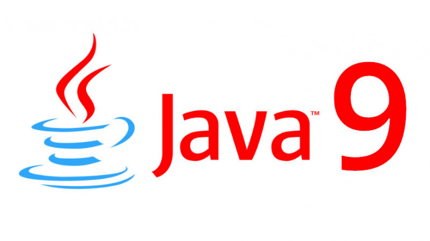

현재 많은 개발자가 Java 8 버전을 사용하여 개발을 하고 있습니다.

Java9 부터는 6개월마다 새로운 버전의 Java가 출시되면서 현재 12버전까지 출시 하였습니다.

그 중에서  JAVA9 버전에 관해 대해 자세히 알아봅니다.


## 마이그레이션시 우려 사항

많은 개발자들이 Java8에서 Java9로 업그레이드 할 때 많은 변경으로 인해 애플리케이션이 중단될수 있다는 걱정이 있습니다. 변경 사항 중 하나는 내부 API의 캡슐화 입니다. 애플리케이션에서 내부 API를 사용하지 않는 경우 Java9 이상으로 마이그레이션 하는것은 어렵지 않습니다.


## 알아두면 좋을 변경된 점


### **110: HTTP 2 Client**


HTTP/2 와 WebSocket을 구현하는 새로운 HTTP 클라이언트 API가 제공되어 기존 HttpURLConnection API를 대체할수 있다.

```java
HttpClient client = HttpClient
    .newBuilder()
    .version(Version.HTTP_2)
    .build();


HttpResponse<String> response = client.send(
    HttpRequest
        .newBuilder(TEST_URI)
        .POST(BodyProcessor.fromString("Hello world"))
        .build(),
    BodyHandler.asString()
);


List<CompletableFuture<String>> responseFutures = new Random()
    .ints(10)
    .mapToObj(String::valueOf)
    .map(message -> client
        .sendAsync(
          HttpRequest.newBuilder(TEST_URI)
            .POST(BodyProcessor.fromString(message))
            .build(),
          BodyHandler.asString()
        )
        .thenApply(r -> r.body())
    )
    .collect(Collectors.toList());

CompletableFuture.allOf(responseFutures.toArray(new CompletableFuture<?>[0])).join();

responseFutures.stream().forEach(future -> {
  LOGGER.info("Async response: " + future.getNow(null));
});


Map<HttpRequest, CompletableFuture<HttpResponse<String>>> responses =
  client.sendAsync(
    HttpRequest.newBuilder(TEST_URI)
      .POST(BodyProcessor.fromString(TEST_MESSAGE))
      .build(),
    MultiProcessor.asMap(request -> Optional.of(BodyHandler.asString()))
  ).join();

responses.forEach((request, responseFuture) -> {
  LOGGER.info("Async response: " + responseFuture.getNow(null));
});
```


### 앞으로 다뤄질 내용

- Java9에서 달라진점


